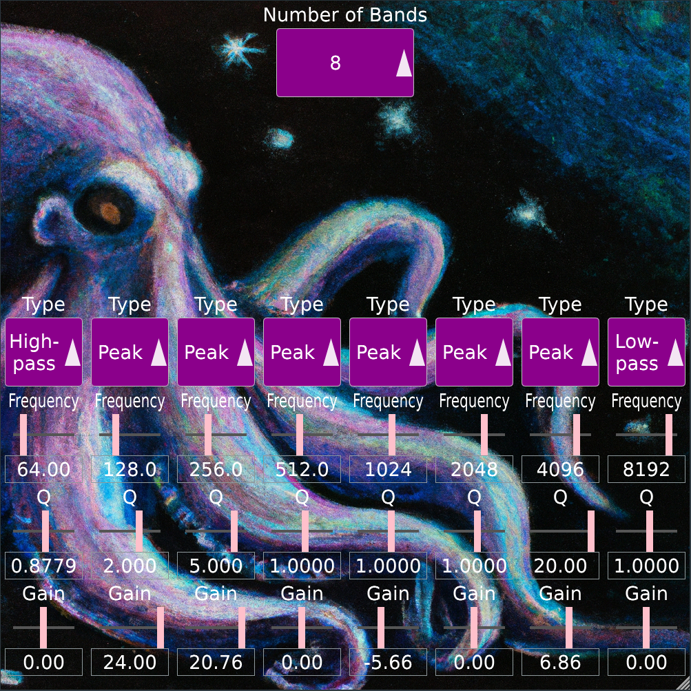

# HayesEQ
A Basic parametric EQ plugin built with JUCE that features a variable number of filter bands (1-8) and a fully continuously-resizable GUI.
The number of filters present at any given time can be changed, and each filter can operate as a peak filter, a band-pass, a low-pass or a high-pass.

